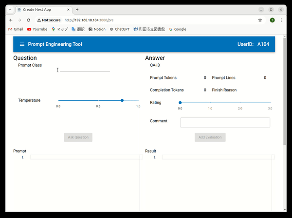
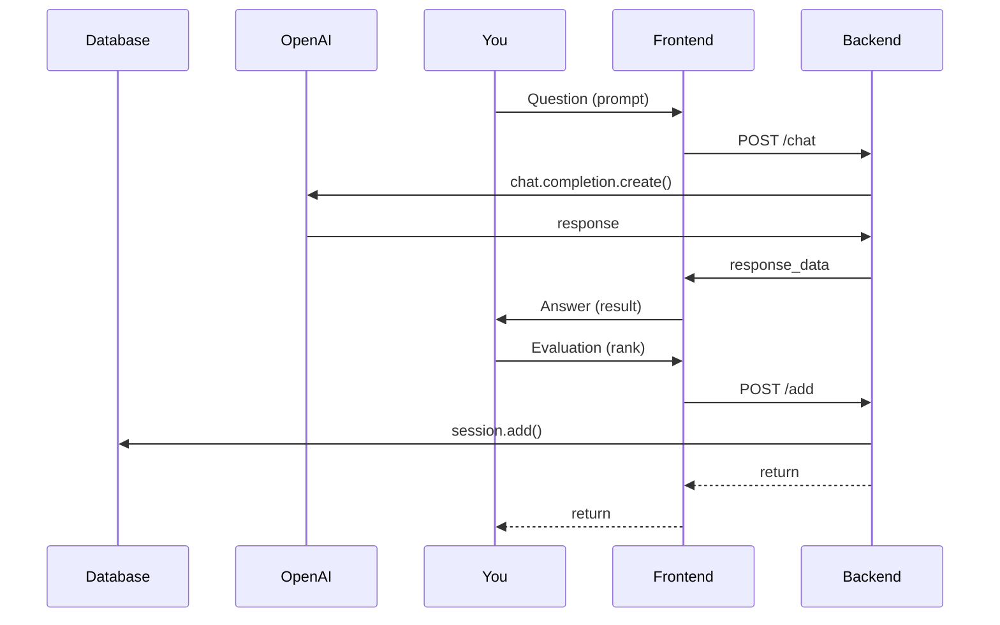
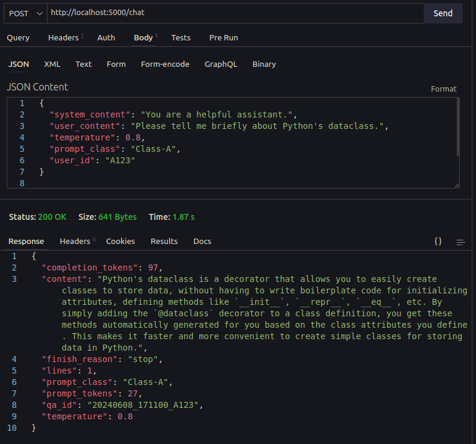

Question/Answering Engineering Tool

## Overview

This project is a question/answering application created by the author to learn how to develop GenAI applications and to utilize popular languages such as Python and TypeScript.

### Demo



The documentation is designed to be straightforward and easy to understand, particularly for beginner to intermediate programmers. If you encounter any unclear points or have suggestions for better ways to write the code, your comments and feedback are greatly appreciated. Let's continue learning step by step!

## Key Feature

- Saving questions and answers: Saved in a toml file with date and time as the key.
- Temperature and prompt class can be specified. The prompt class can be specified by the user as a verification viewpoint or category when evaluating the prompt content and its answer.
- Saving operation logs: You can save the backend operation history using flask logger.

## Basic Sequence



## Prerequisites

Ubuntu, Python, Node.js, sqlite3, API Development Tool, ...

## Requirements

### Backend

- Python, pip
- Flask
- Other Python packages : dataclass, datetime, load_dotenv, current_app, Tuple, Union

### Frontend

- React
- Material UI
- axios
- monaco-editor
- react-dropzone

### Both

- Node.js (for frontend and mock server)

## Installation & Setup

The steps outlined here might seem a bit tedious, but if you try to do everything at once and it doesn't work, it will be difficult to identify the cause. More haste, less speed.

<details>
<summary>Step-1. Download</summary>

### Step-1. Download

Create your project directory and download programs.

```
$ mkdir (your_project)
$ cd (your_project)
$ git clone https://xxxxx
```

</details>

<details>
<summary>Step-2. Setup backend environment</summary>

### Step-2. Setup backend environment

#### 1. Python(venv)

First, create a python virtual environment.

**install**

```
$ cd backend
$ sudo apt install python3.10-venv
```

**create virtual environmnets**

```
$ python -m venv .venv
```

**activate**
Depending on your environment, when you run the following command, your command prompt will probably change to "(.venv)$"

```
$ . .venv/bin/activate
```

#### 2. Python Package

Next, install the packages defined in requirements.txt

```
(.venv)$ pip freeze -r requirements.txt
```

#### 3. Create directories

Next, create three directories required for starting the backend server. These directories names ca be changed with environment variables.

```
(.venv)$ mkdir log
(.venv)$ mkdir qa_db
(.venv)$ mkdir qa_log
```

#### 4. Modify environment variables

Next, set the environment variables to complete the setup procedure. Modify the downloaded .env file. The OPENAI_API_KEY written in file is incomplete. Set the correct key.

#### 5. Create database and table

Run this command. Then, use the sqlite3 command to see if the table was created.

```
(.venv)$ python pre_setup.py
...
(.venv)$ sqlite3 qa_db/qae.db
sqlite> .tables
evaluation
sqlite> .schema evaluation
CREATE TABLE evaluation (
	id INTEGER NOT NULL,
	qa_id VARCHAR NOT NULL,
	lines INTEGER NOT NULL,
	prompt_class VARCHAR NOT NULL,
	temperature FLOAT NOT NULL,
	completion_tokens INTEGER NOT NULL,
	prompt_tokens INTEGER NOT NULL,
	rating FLOAT NOT NULL,
	comment VARCHAR NOT NULL,
	PRIMARY KEY (id)
);
sqlite>
```

</details>

<details>
<summary>Step-3. Check the backend server running</summary>

### Step-3. Check the backend server running

#### 1. run the application

To run the application, use the flask command.

```
(.venv)$ flask run
 * Debug mode: off
WARNING: This is a development server. Do not use it in a production deployment. Use a production WSGI server instead.
 * Running on http://127.0.0.1:5000
Press CTRL+C to quit

```

#### 2. Sending POST request

Let's try to see if the backend server can actually receive a POST request. For example, you can use Thunder Client, and use the json data from "backend/apitest/req_post_chat.json".

- URL: http://localhost:5000/chat
- Method: POST
- Json Data: see below

```json
{
  "system_content": "You are a helpful assistant.",
  "user_content": "Please tell me briefly about Python's dataclass.",
  "temperature": 0.8,
  "prompt_class": "Class-A",
  "user_id": "A123"
}
```

After you click the "Send" button, make sure you see a response with status 200.



</details>

<details>
<summary>Step-4. Setup frontend environment</summary>

### Step-4. Setup frontend environment

#### 1. Node.js Package

Install the required Node.js packages base on the downloaded package.json.

```
$ cd (your-project)/frontend
$ npm install
```

#### 2. Modify environment variables

This may not be necessary if you have followed this guide. Adjust the ".env.local" file according to your environment.

[.env.local]

```
NEXT_PUBLIC_API_SERVER_URL=http://localhost:3001
NEXT_PUBLIC_SYSTEM_CONTENT="You are a helpful assistant."
NEXT_PUBLIC_MAX_PROMPT_FILESIZE=100000

```

Note: Details will be explained in the steps below, but to verify the operation step-by-step, specify the URL of the mock server in NEXT_PUBLIC_API_SERVER_URL.

#### 3. Setting up permissions on a script

Set the permissions for the shell script get_ip.sh used in npm-scripts.

```
$ chmod +x get_ip.sh
```

</details>
<details>
<summary>Step-5. Check the frontend server running</summary>

### Step-5. Check the frontend server running

#### 1. Start mock server

Install the required packages for mock server.

```
$ cd (your-project)/back_mock
$ npm install
```

#### 2. Run the mock server

Run the mock server. A log file named mock.log will be created in the current directory.

```
$ node mock.js
```

#### 3. Run the frontend server

Run the frontend server.

```
$ cd (your-project)/frontend
$ npm run dev
```

The following messages will be output to the console log:

```
> qae_app@0.1.0 dev
> npm run set-ip-and-dev


> qae_app@0.1.0 set-ip-and-dev
> IP=$(npm run get-ip --silent) && next dev -H $IP

  ▲ Next.js 14.2.3
  - Local:        http://192.168.10.104:3000
  - Network:      http://192.168.10.104:3000
  - Environments: .env.local

 ✓ Starting...
 ✓ Ready in 2s
```

#### 4. Launching browser

Start the browser by specifying the IP address output to the console.log.

(top display capture)

#### 5. xxxx

Once the screen opens, enter the following items and click the "Ask Question" button.

- Prompt Class: Test-Pattern-A1
- Prompt: How's it going?

(display image)

It's OK if a response message is displayed on the right side of the screen as shown below.

(display image)

</details>

<details>
<summary>Step-6. Connecting backend server and frontend server</summary>

### Step-6. Connecting backend server and frontend server

Finally, the last step is to rewrite the frontend environment definition to connect to a real backend server instead of a mock one.

[.env.local]

```
NEXT_PUBLIC_API_SERVER_URL=http://localhost:5000
NEXT_PUBLIC_SYSTEM_CONTENT="You are a helpful assistant."
NEXT_PUBLIC_MAX_PROMPT_FILESIZE=100000

```

Restart the frontend server, open the browser, and try operating the screen in the same way as before.

(image)

Make sure you get a response from OpenAI, not a fiexed message from a mock.

</details>

## How To Use

### Question/Answering

#### 1. Input Prompt Class

You can enter the prompt directly in the "Prompt" field at the bottom left of the screen, or you can enter the prompt by clicking the menu icon at the top left of the screen to display Side-Menu, clicking User-Content, and loading a text file from File Explorer.

#### 2. Input Prompt Class

When you evaluate a prompt, you first decide on an evaluation perspective and try out a few different prompts. The prompt class is a test category that represents that evaluation perspective. Please enter a short phrase.

If you enter both prompt and prompt class, "Ask Question" button will be enabled.

#### 3. Ask Question

#### 4. Check QA Log

### Evaluation

#### 1. Input Rank

#### 2. Input Comments

#### 3. Add Evaluation

#### 4. Check Database
