# Question/Answering Engineering Tool

## Overview

This project is a Question/Answering application I developed to learn prompt engineering techniques through building a GenAI application, while also gaining experience with modern development practices in languages like Python and TypeScript.

### Demo

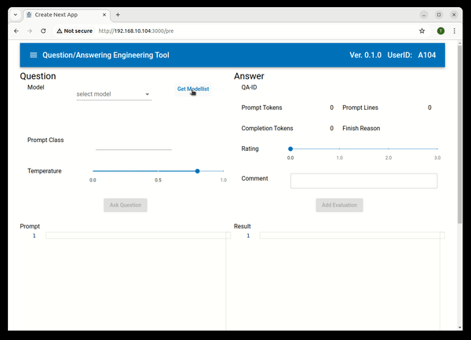

The documentation is designed to be straightforward and easy to understand, particularly for beginner to intermediate programmers. If you encounter any unclear points or have suggestions for better ways to write the code, your comments and feedback are greatly appreciated. Let's continue learning step by step!

## Key Feature

- Saving questions and answers: These are saved in a toml file with the date and time as the key. Some elements of the response data from OpenAI are also saved.
- You can select the model, specify temperature and prompt class. The prompt class can be freely specified by the user, such as the verification viewpoint or test case number.
- Saving operation logs: The flask logger is used to save backend operation and event logs, debug information, etc.

## Basic Sequence

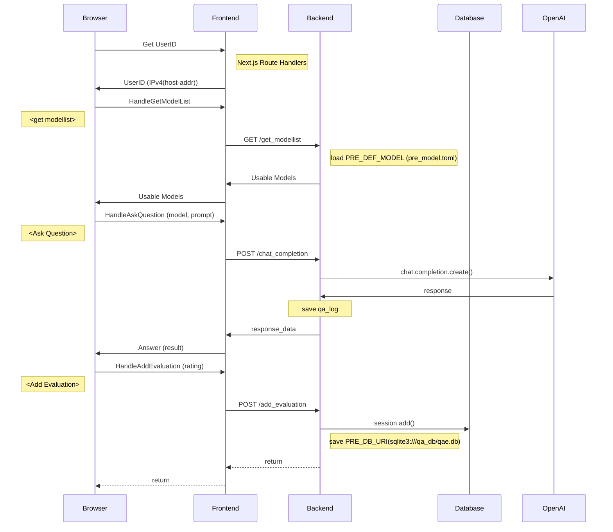
```mermaid
sequenceDiagram
    participant Browser
    participant Frontend
    participant Backend
    participant Database
    participant OpenAI
    Browser->>Frontend: Get UserID
    Note right of Frontend: Next.js Route Handlers
    Frontend->>Browser: UserID (IPv4(host-addr))
    Browser->>Frontend: HandleGetModelList
    Note left of Browser: <get modellist>
    Frontend->>Backend: GET /get_modellist
    Note right of Backend: load PRE_DEF_MODEL (pre_model.toml)
    Backend->>Frontend: Usable Models
    Frontend->>Browser: Usable Models
    Browser->>Frontend: HandleAskQuestion (model, prompt)
    Note left of Browser: <Ask Question>
    Frontend->>Backend: POST /chat_completion
    Backend->>OpenAI: chat.completion.create()
    OpenAI->>Backend: response
    Note over Backend: save qa_log
    Backend->>Frontend: response_data
    Frontend->>Browser: Answer (result)
    Browser->>Frontend: HandleAddEvaluation (rating)
    Note left of Browser: <Add Evaluation>
    Frontend->>Backend: POST /add_evaluation
    Backend->>Database: session.add()
    Note right of Backend: save PRE_DB_URI(sqlite3:///qa_db/qae.db)
    Backend-->>Frontend: return
    Frontend-->>Browser: return
```

## Prerequisites

### OS

I typically develop on Ubuntu, but I managed to get it running on Windows as well.

```
$ lsb_release -a
No LSB modules are available.
Distributor ID:	Ubuntu
Description:	Ubuntu 22.04.4 LTS
Release:	22.04
Codename:	jammy
$

```

### Software

- Python >= 3.10, (pyenv)
- Flask >= 3.0
- Sqlite >= 3.37
- Node >= 20.14, (nvm)

If you haven't installed these software applications yet, please refer to the notes below.

<details>
<summary>Install Python (pyenv)</summary>
Please refer to the following website.

https://github.com/pyenv/pyenv

First, install pyenv and set the necessary environment variables.

```
$ cd ~
$ git clone https://github.com/pyenv/pyenv.git ~/.pyenv
...
$
$ echo 'export PYENV_ROOT="$HOME/.pyenv"' >> ~/.bashrc
$ echo 'command -v pyenv >/dev/null || export PATH="$PYENV_ROOT/bin:$PATH"' >> ~/.bashrc
$ echo 'eval "$(pyenv init -)"' >> ~/.bashrc
$
```

Next, check the available Python versions and install them by specifying the version number.

```
$ pyenv install --list
Available versions:
  2.1.3
  2.2.3
...
$
$ pyenv install 3.12.4
Downloading Python-3.12.4.tar.xz...
...
$
$ pyenv versions
* system (set by /home/takashi/.pyenv/version)
  3.12.4
$
$ which python
/home/takashi/.pyenv/shims/python
$
$ pyenv global 3.12.4
$ pyenv local 3.12.4
$ pyenv version
3.12.4 (set by /home/takashi/.python-version)
$ python --version
Python 3.12.4
$ pip --version
pip 24.0 from /home/takashi/.pyenv/versions/3.12.4/lib/python3.12/site-packages/pip (python 3.12)
$
```

</details>

<details>
<summary>Install Flask</summary>
Please refer to the following website.

https://flask.palletsprojects.com/en/3.0.x/installation/#install-flask

```
$ pip install Flask
...
$
$ flask --version
Python 3.12.4
Flask 3.0.3
Werkzeug 3.0.3
$
```

</details>

<details>
<summary>Install Sqlite</summary>
For ubuntu, you can install it as follows.

```
$ sudo apt install sqlite3
...
$
$ which sqlite3
/usr/bin/sqlite3
$ sqlite3 --version
3.37.2 2022-01-06 13:25:41 872ba......
$
```

</details>

<details>
<summary>Install Node (nvm)</summary>
Please refer to the following website.

https://github.com/nvm-sh/nvm

First, install nvm.

```
$ curl -o- https://raw.githubusercontent.com/nvm-sh/nvm/v0.39.7/install.sh | bash
...
$ nvm --version
0.39.7
$
```

Next, check the available Node versions and install them by specifying the version number.

```
$ nvm ls-remote
  v0.1.14
  v0.1.15
  ...
$
$ nvm install v20.14.0
Downloading and installing node v20.14.0...
...
$ node --version
v20.14.0
$
```

</details>

## Installation & Setup

The steps outlined here might seem a bit tedious process, but if you try to do everything at once and it doesn't work, it will be difficult to identify the cause. More haste, less speed.

<details>
<summary>Step-1. Download</summary>

### Step-1. Download

Create your project directory and download programs.

```
$ mkdir (your-project)
$ cd (your-project)
$ git clone https://github.com/Takashi-KK/qae
```

</details>

<details>
<summary>Step-2. Setup backend environment</summary>

### Step-2. Setup backend environment

<details>
<summary>1. Python Packages</summary>
First, install the packages defined in requirements.txt

```
$ cd qae/backend
$ pip install -r requirements.txt
...
$
```

</details>

<details>
<summary>2. Setting Environment Variables</summary>
To run the backend server, you need to set some environment variables. Here is an example:

**(your-project)/qae/backend/.env**

```
# --- for input ---

# OpenAI API Key
OPENAI_API_KEY="sk-......."
#AZURE_OPENAI_API_KEY="xxxxx"

# Available Model Definitions
PRE_DEF_MODEL="pre_model.toml"

# OpenAI API Runmode
#PRE_RUNMODE="Mock"		# Runmode: "Mock" or nothing

# Mockdata for OpenAI API Response
PRE_MOCKDATA_FILE="./pre_mockdata.json"

# --- for output ---

# Event/Debug Log Directory (.log)
PRE_LOG_DIR="./log/"

# QA Log (.toml)
PRE_QA_LOG_DIR="./qa_log/"

# Sqlite3 Database
PRE_DB_URI="sqlite:///qa_db/qae.db"

```

**OPENAI_API_KEY (AZURE_OPENAI_API_KEY)**

As the name suggests.

https://platform.openai.com/docs/quickstart

**PRE_DEF_MODEL**

Specifies the file name that defines the available models.

**PRE_RUN_MODE**

If you set the string "Mock", a mock version of the OpenAI API will be used (no requests will be sent to OpenAI).

**PRE_MOCKDATA_FILE**

If the above PRE_RUN_MODE is set to "Mock", specify the file name that contains the mock response content equivalent to the response from the OpenAI API.

**PRE_LOG_DIR**

Specifies the directory where event logs and debug logs will be stored when the backend server is running.

**PRE_QA_LOG_DIR**

When making a request with the OpenAI API, the parameter values, request details, and some elements of the response object are saved in a TOML file. This variable specifies where the file is stored.

**PRE_DB_URI**

The QA information, stored as a TOML file in the specified directory, is recorded as a table with a unique QA-ID and its corresponding rating. This variable specifies the database name in URI format.

</details>

<details>
<summary>3. Model Definition</summary>
Specify the connection details for the model you want to use. Write to the file specified by the PRE_DEF_MODEL environment variable (pre_model.toml is provided as an example).

**name**

This key represents the connection information for the model, and users can freely specify a name for it. The name defined here will be displayed in a list on the frontend and used to select the model you want to use.

**llm_service**

Currently, only "OpenAI" and "Azure" can be specified.

**deployment_name**

The name of the model used when sending requests to the OpenAI.

**api_key**

Rather than specifying the API_KEY directly, use the environment variable name defined in your .env file, such as OPENAI_API_KEY or AZURE_OPENAI_API_KEY.

**api_version**

(Azure only) Specify the API version when creating an AzureOpenAI instance.

**api_endpoint**

(Azure only) Specify the API endpoint when creating an AzureOpenAI instance.

</details>

<details>
<summary>4. Create Directories</summary>

Next, create the three directories needed to start the backend server. Create it in the (your-project)/qae/backend directory.

### CreateEvent/Debug Log Directory

Create a directory named as specified by the PRE_LOG_DIR environment variable.

```
$ mkdir log
```

### Create QA Log Directory

Create a directory named as specified by the PRE_QA_LOG_DIR environment variable.

```
$ mkdir qa_log
```

### Create QA DB Directory

This matches the directory name specified in PRE_DB_URI.

```
(.venv)$ mkdir qa_db
```

</details>

<details>
<summary>5. Create Evaluation Table</summary>
Run this command. Then, use the sqlite3 command to see if the table was created.

```
$ python pre_setup.py
...
$ sqlite3 qa_db/qae.db
sqlite> .tables
evaluation
sqlite> .schema evaluation
CREATE TABLE evaluation (
	id INTEGER NOT NULL,
	qa_id VARCHAR NOT NULL,
	lines INTEGER NOT NULL,
	prompt_class VARCHAR NOT NULL,
	temperature FLOAT NOT NULL,
	completion_tokens INTEGER NOT NULL,
	prompt_tokens INTEGER NOT NULL,
	rating FLOAT NOT NULL,
	comment VARCHAR NOT NULL,
	PRIMARY KEY (id)
);
sqlite>
```

The backend environment setup is now complete. Next, we will verify the backend startup independently (without using the frontend app).

</details>

</details>

<details>
<summary>Step-3. Check the backend server running</summary>

### Step-3. Check the backend server running

#### 1. Run the backend application

To run the application, use the flask command.

```
$ flask run
 * Debug mode: off
WARNING: This is a development server. Do not use it in a production deployment. Use a production WSGI server instead.
 * Running on http://127.0.0.1:5000
Press CTRL+C to quit
```

#### 2. Sending some requests

> [!NOTE]
> Before performing the following operations, ensure that the "run-mode" is set to mock mode.
> PRE_RUNMODE="Mock"

Send a request to the backend server using an API client tool. For example, you can use Thunder Client, a VSCode extension. First, send a request to the endpoint below using the GET method to verify if you can retrieve the response data (a list of model connection information).

- URL: http://localhost:5000/get_modellist
- Method: GET

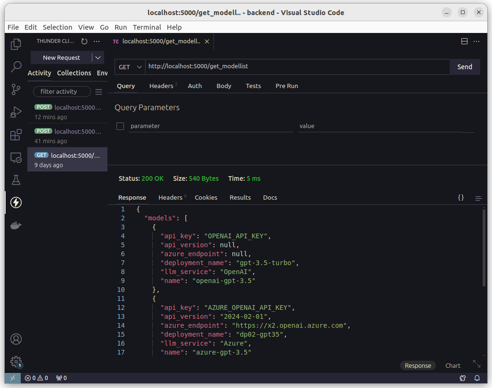

This JSON response data is generated based on the information defined in pre_model.toml (the file specified by the environment variable PRE_DEF_MODEL).

Next, send a POST request with the data from "apitest/req_post_chat_completion.json".

- URL: http://localhost:5000/chat_completion
- Method: POST
- Json Data: see below

```json
{
  "system_content": "[Mock Data]You are a helpful assistant.",
  "user_content": "[Mock Data]Please tell me briefly about Python's dataclass.",
  "temperature": 0.9,
  "prompt_class": "test case #003",
  "user_id": "A555",
  "selected_model": "openai-gpt-3.5"
}
```

After you click the "Send" button, make sure you see a response with status 200.

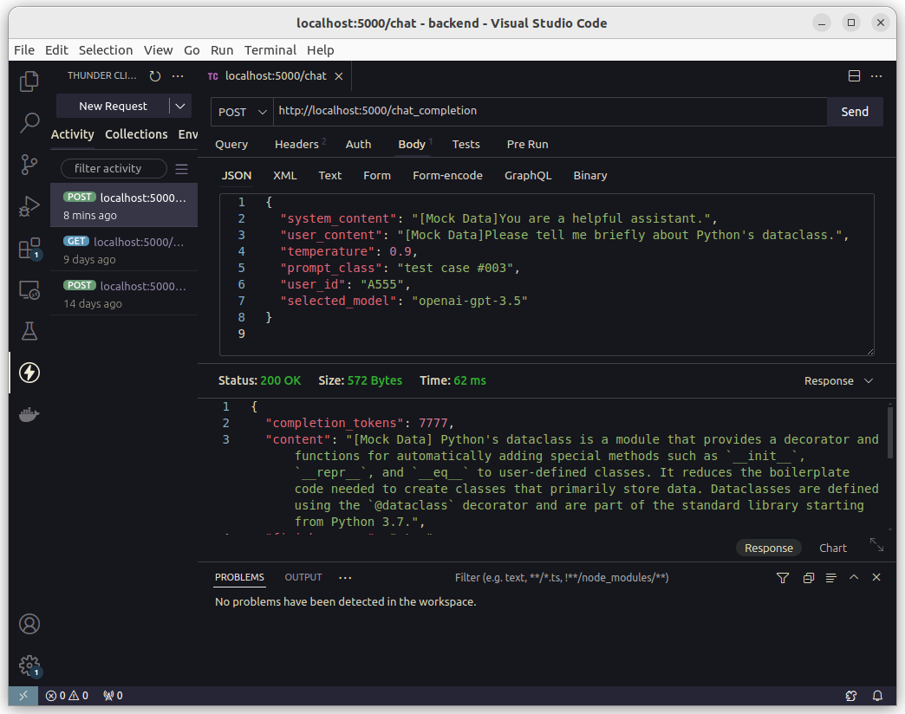

"As a side note, the response data is generated based on the contents of pre_mockdata.json, which is specified by the environment variable PRE_MOCKDATA_FILE."

Similarly, send a request to the add_evaluation endpoint using the POST method. Use apitest/req_post_add_evaluation.json as the data to be sent.

- URL: http://localhost:5000/add_evaluation
- Method: POST
- Json Data: see below

```
{
  "qa_id": "99990599_160220_A123",
  "lines": 5,
  "prompt_class": "TestCase-AAA",
  "temperature": 0.8,
  "completion_tokens": 7777,
  "prompt_tokens": 8888,
  "rating": 2.5,
  "comment": "[Mock Data]Good Prompt"
}
```

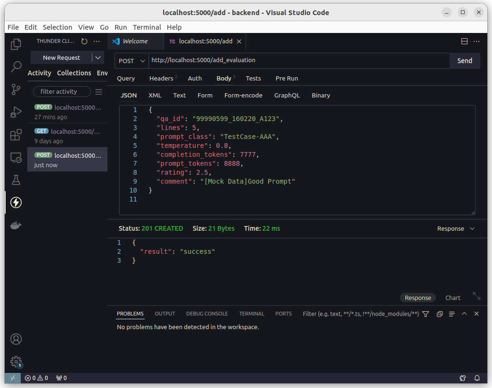

If these three requests function correctly, you can verify that the backend server environment has been set up correctly. Once the backend server environment is established, you can proceed to configure the frontend server environment.

</details>

<details>
<summary>Step-4. Setup frontend environment</summary>

### Step-4. Setup frontend environment

#### 1. Node Packages

Install the required Node.js packages base on the downloaded package.json.

```
$ cd (your-project)/frontend
$ npm install
```

#### 2. Setting environment variables

To run the frontend server, you need to set some environment variables. Here is an example:

**(your-project)/qae/frontend/.env_local**

```
NEXT_PUBLIC_API_SERVER_URL=http://localhost:3001
NEXT_PUBLIC_SYSTEM_CONTENT="You are a helpful assistant."
NEXT_PUBLIC_MAX_PROMPT_FILESIZE=100000
NEXT_PUBLIC_APP_VERSION=$npm_package_version

```

> [!IMPORTANT]
> As mentioned later, the URL http://localhost:3001 serves as the mock address for the backend server.
> A Flask application typically uses the URL http://localhost:5000 as its address.

**NEXT_PUBLIC_API_SERVER_URL**

Specifies the URL of the backend server (i.e. the Flask server).

**NEXT_PUBLIC_SYSTEM_CONTENT**

Define the content of system messages for the messages parameter used in QA with OpenAI. For more details, refer to the following website:

https://platform.openai.com/docs/guides/text-generation

**NEXT_PUBLIC_MAX_PROMPT_FILESIZE**

As part of this application's functionality, besides entering prompts directly on the screen, you can also load previously created text files from Explorer. This feature is convenient for templating prompt content.
However, selecting a large file by mistake could result in it being sent to OpenAI, leading to significant charges. To mitigate this risk, you can specify a maximum file size in advance and perform a size check upon loading.

**NEXT_PUBLIC_APP_VERSION**

This component reads the application version information from package.json and displays it on the screen. Please do not modify this item.

The front-end server environment setup is now complete. Next, verify that the server is running.

</details>
<details>
<summary>Step-5. Check the frontend server running</summary>

### Step-5. Check the frontend server running

<details>
<summary>1. Run the frontend server</summary>

> [!NOTE]
> This application will always run in development mode. The purpose of this project is to learn prompt engineering techniques and explore modern development methods simultaneously.

Run the frontend server.

```
$ cd (your-project)/frontend
$ npm run dev

> qae_app@0.1.0 dev
> next dev

  ▲ Next.js 14.2.3
  - Local:        http://localhost:3000
  - Environments: .env.local

 ✓ Starting...
 ✓ Ready in 1436ms

```

</details>

<details>
<summary>2. Launching browser</summary>

> [!IMPORTANT]
> Before launching the browser, ensure that the environment variables defined in ".env.local" are set as follows:
> NEXT_PUBLIC_API_SERVER_URL=http://localhost:3001
> (Backend mock server)

> [!NOTE]
> Before launching your browser, please check the IP address of your computer. This application utilizes the fourth octet of the IP address to identify users in a simplified manner, without requiring user registration.

Launch your web browser and enter the following URL:

URL: http://(your-ip-address):3000/pre

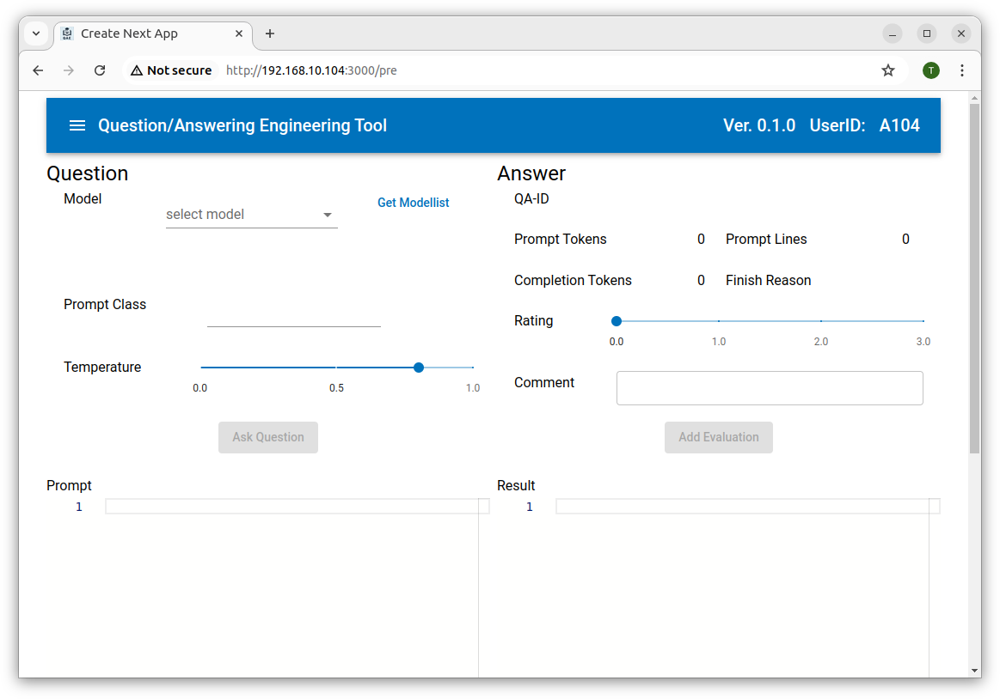

> [!IMPORTANT]
> Avoid using localhost; always use an IP address instead.

</details>

<details>
<summary>3. Backend mock environment setup and startup</summary>

To verify the frontend application is working, start the backend mock. Begin by setting up the backend mock environment.

**Install Node Packages**

Install the packages required for mock startup.

```
$ cd (your-project)/qae/back_mock
$ npm install
...
$
```

**Mock Start**

Start the mock. If it starts successfully, the following log will be displayed.

```
$ node mock.js
20240707 13:20:35.379 INFO  Server running on port 3001
```

After verifying that the mock is working, the next step is to review the user interface instructions.

</details>

<details>
<summary>4. User interface instructions</summary>

**Get Modellist**

First, click the 'get_modellist' button in your browser to verify that the model names are displayed.

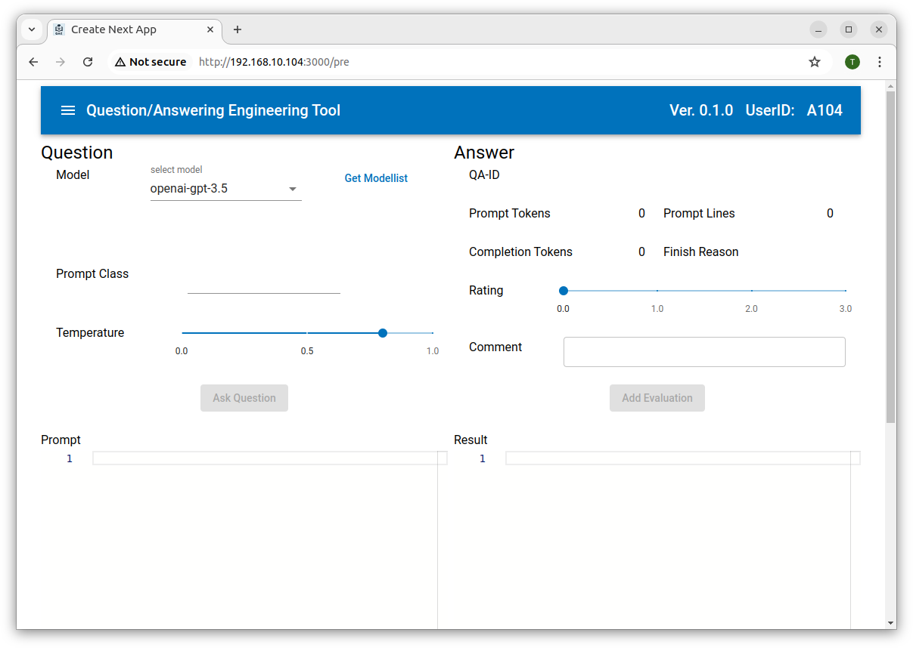

On the mock side, verify that a log is generated indicating the mock data (get_modellist.json) has been loaded.

```
20240707 13:48:40.203 INFO  --- POST(/get_modellist) request received ---
20240707 13:48:40.205 INFO  --- POST response ---
```

For your reference, a mock.log file will be created in the same directory. This file logs the contents of the loaded mock data, which can be helpful for debugging.

```
20240707 13:48:40.203 INFO  --- POST(/get_modellist) request received ---
20240707 13:48:40.204 DEBUG data.models.length : 3
20240707 13:48:40.204 DEBUG model[0] :
{
  api_key: '[Mockdata]OPENAI_API_KEY',
  api_version: null,
  azure_endpoint: null,
  deployment_name: 'gpt-3.5-turbo',
  ...
}
...
```

**Ask Question**

Next, input appropriate strings into the Prompt Class and Prompt fields, then verify if the "Add Question" button is enabled.

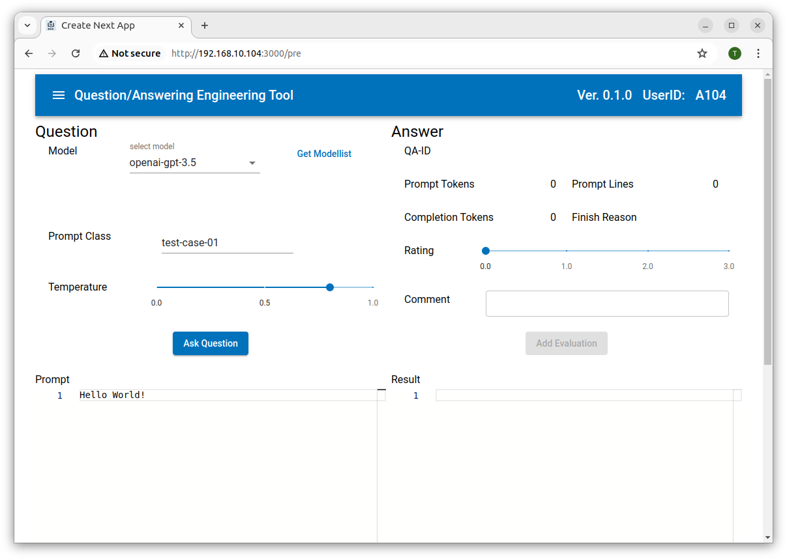

Click the “Ask Question” button. The response data from the mock will be displayed.

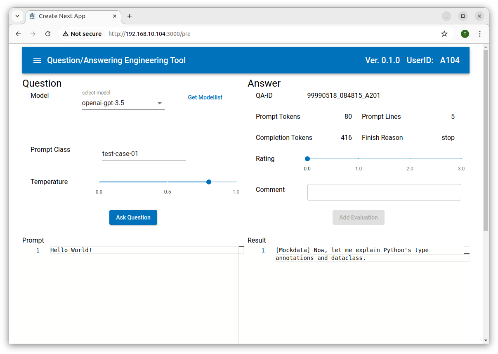

**Add Evaluation**

Set the Rating slider to 1.5 and enter text in the Comment field to enable the 'Add Evaluation' button.

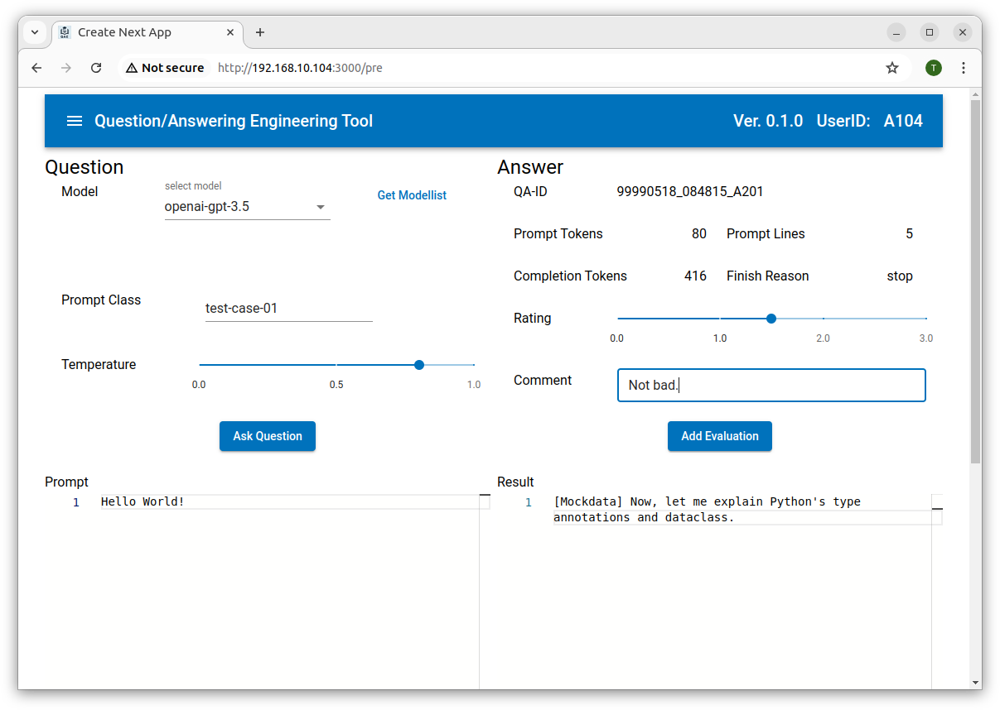

Click the “Add Evaluation” button. Ensure that the "Added Successfully" message is displayed.

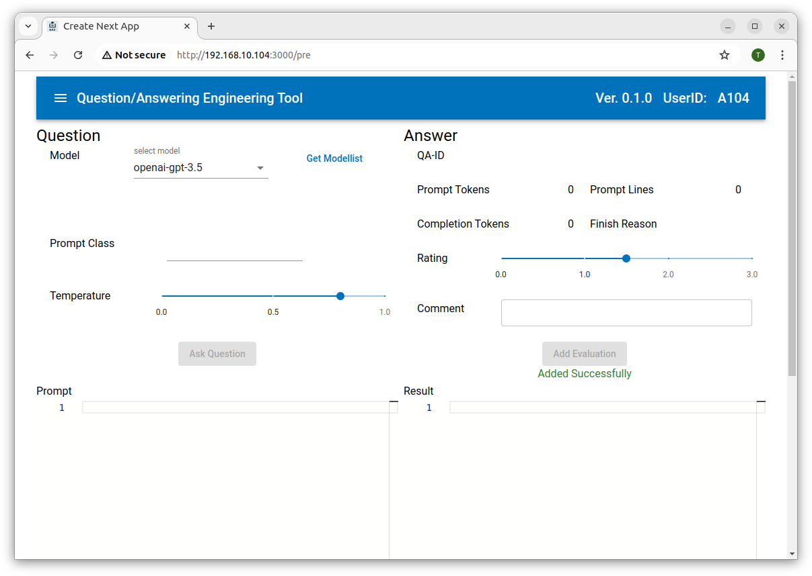

> [!NOTE]
> The "Added Successfully" message will automatically disappear after a few seconds.

Instructions confirmation is now complete. In the next step, we will establish end-to-end communication from the frontend to the backend and OpenAI, conducting final operational checks.

</details>

<details>
<summary>Step-6. End-to-end communications</summary>

### Step-6. End-to-end communications

<details>
<summary>1. frontend to backend</summary>

**Start Backend Server**

Start the backend server at this point, still specifying PRE_RUNMODE='Mock'.

```
$ flask run
 * Debug mode: off
WARNING: This is a development server. Do not use it in a production deployment. Use a production WSGI server instead.
 * Running on http://127.0.0.1:5000
Press CTRL+C to quit

```

**Modifying the .env.local**

Adjusting frontend environment settings. Set the environment variable NEXT_PUBLIC_API_SERVER_URL to the address (including the port number) of the Flask Server you have just started.

```
NEXT_PUBLIC_API_SERVER_URL=http://localhost:5000
NEXT_PUBLIC_SYSTEM_CONTENT="You are a helpful assistant."
NEXT_PUBLIC_MAX_PROMPT_FILESIZE=100000
NEXT_PUBLIC_APP_VERSION=$npm_package_version
```

**Run the frontend**

Run the frontend server.

```
$ cd (your-project)/frontend
$ npm run dev

> qae_app@0.1.0 dev
> next dev

  ▲ Next.js 14.2.3
  - Local:        http://localhost:3000
  - Environments: .env.local

 ✓ Starting...
 ✓ Ready in 1436ms

```

**Launching browser**

Launch your web browser and enter the following URL:

URL: http://(your-ip-address):3000/pre

**Get Modellist**
Click the "Get Modellist" button, and check the backend server console log.

```
20240707 14:57:20.332 INFO     app      --- GET /get_modellist received ---
20240707 14:57:20.335 INFO     app      --- GET /get_modellist return ---
127.0.0.1 - - [07/Jul/2024 14:57:20] "GET /get_modellist HTTP/1.1" 200 -
```

**Add Question**

Next, input appropriate strings into the Prompt Class and Prompt fields, click the “Ask Question” button.

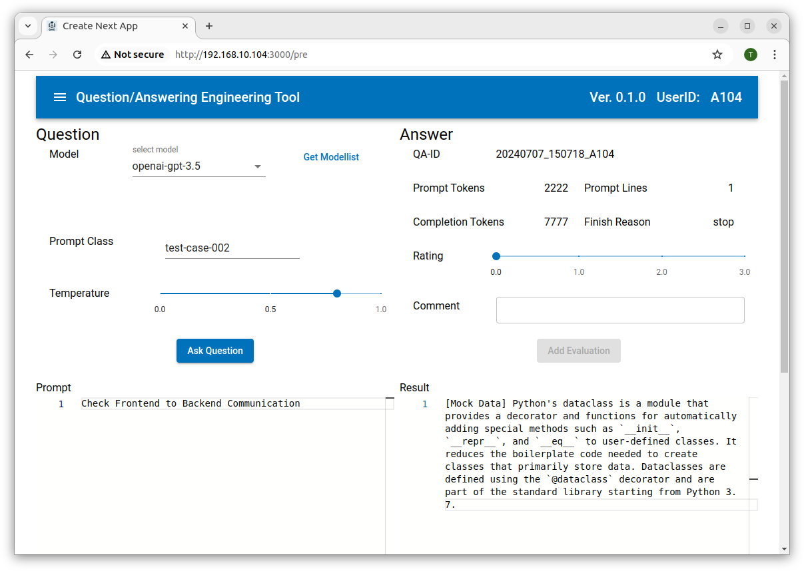

Now, check the directory below to verify if a QA log has been created by the current query.

```
$ cd (your-project)/qae/backend/qa_log
$ cat 20240707_150718_A104.toml
[qa_request]
model = "gpt-3.5-turbo"
temperature = 0.8
prompt_class = "test-case-002"
[[qa_request.messages]]
role = "system"
content = "You are a helpful assistant."

[[qa_request.messages]]
role = "user"
content = "Check Frontend to Backend Communication"

[qa_response]
finish_reason = "stop"
content = "[Mock Data] Python's dataclass is a module that provides a decorator and functions for automatically adding special methods such as `__init__`, `__repr__`, and `__eq__` to user-defined classes. It reduces the boilerplate code needed to create classes that primarily store data. Dataclasses are defined using the `@dataclass` decorator and are part of the standard library starting from Python 3.7."
completion_tokens = 7777
prompt_tokens = 2222
$
```

> [!NOTE]
> The directory name qa_log corresponds to the name specified by the environment variable PRE_QA_LOG_DIR.

> [!NOTE]
> The details about this TOML file will be explained in another section.

> [!NOTE]
> The response data is generated based on mock data (pre_mockdata.json).

</details>

<details>
<summary>2. frontend to backend and OpenAI</summary>

After stopping the backend you started earlier, modify the '.env' file.

- Verify that the correct value is set for OPENAI_API_KEY (AZURE_OPENAI_API_KEY).
- Comment out PRE_RUNMODE.

After restarting the frontend and the browser, repeat the previous steps and click on 'Ask Question.' Verify the response data from OpenAI.

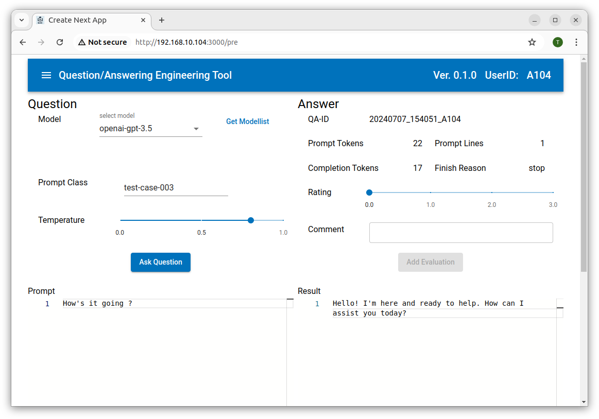

> [!NOTE]
> The response data is generated based on mock data (pre_mockdata.json).

> [!TIP]
> I use "How's it going?" as a prompt when verifying the connection with OpenAI. Input operations are quick, and responses from OpenAI are usually short in length (token length), resulting in lower charges :-)

To verify if the result indeed comes from OpenAI, let's inspect the logs. You should find 'app.log' created in the log directory. If the log at that timestamp contains 'OpenAI API Call' and includes the following entry, it confirms receipt of the response message from OpenAI.

> [!NOTE]
> The log directory is specified by the environment variable PRE_LOG_DIR.

```
$ cat app.log
...
20240707 15:40:51.052 DEBUG    app      --OpenAI API Call--
20240707 15:40:52.061 DEBUG    app      <class 'openai.types.chat.chat_completion.ChatCompletion'>
20240707 15:40:52.066 DEBUG    app      {
  "id": "chatcmpl-9iFrnUf4Q1lxwSOwdifRSmRfY5d1k",
  "choices": [
    {
      "finish_reason": "stop",
      "index": 0,
      "logprobs": null,
      "message": {
        "content": "Hello! I'm here and ready to help. How can I assist you today?",
        "role": "assistant",
        "function_call": null,
        "tool_calls": null
      }
    }
  ],
  "created": 1720334451,
  "model": "gpt-3.5-turbo-0125",
  "object": "chat.completion",
  "system_fingerprint": null,
  "usage": {
    "completion_tokens": 17,
    "prompt_tokens": 22,
    "total_tokens": 39
  }
}

...
$
```

</details>

</details>

## How To Use

### Question/Answering

When you launch the backend and frontend and access it from a browser, the following initial screen will be displayed.
QA basically only requires performing five operations.

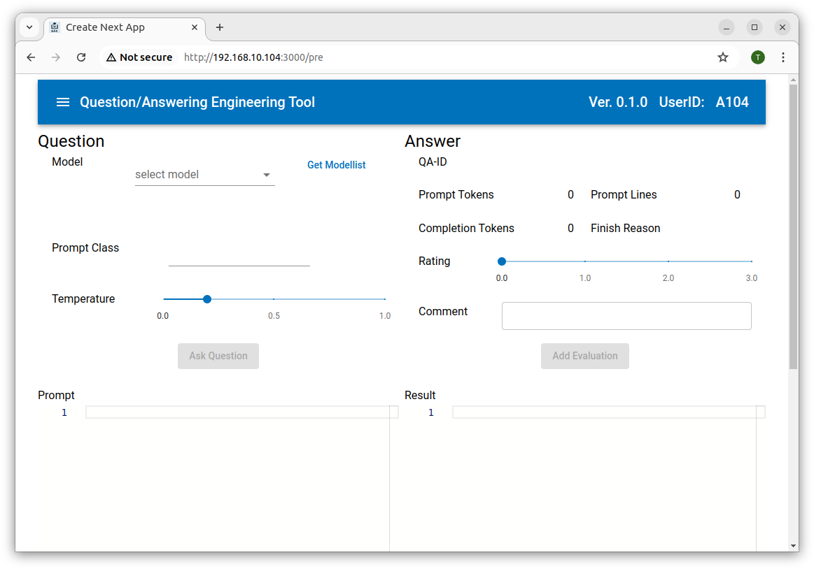

#### 1. Get Modellist

Press the button and select the model you want to use from the list.

#### 2. Input Prompt Class

The Prompt class represents a perspective for experimenting with various prompts. It will also serve to categorize prompts by this perspective when evaluating their values in the future. Entering concise strings will facilitate easier analysis.

#### 3. Input Prompt Class

There are three ways to enter a prompt:

##### (1)Direct

- Enter text directly from the keyboard.

##### (2)Copy and Paste

- Copy the prompt you want to enter and paste it into the Prompt field.

##### (3)Load text file

- Loads a prompt template file that you have previously created.

**How to load prompte template files**

1. Open side panel. Click the menu on the navigation bar to display the side panel.

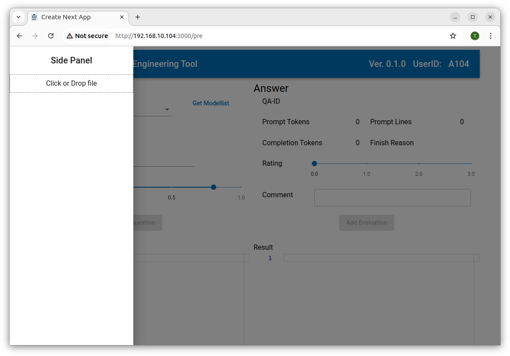

2. Click 'Click or Drop file' to open the 'File Dialog' and choose a file there, or drag a file from Explorer and drop it here.

3. To close the side panel, press the Esc key.

4. Of course, after loading the file, you can change the prompt in the Prompt field.
   i Of course, after loading the file, you can change the prompt in the Prompt field.

#### 4. Set temperature

Set the temperature.

- Higher values: output more random
- Lower values: more focused and deterministic

For more information, please refer to the following document:

https://platform.openai.com/docs/api-reference/chat/create

> [!IMPORTANT]
> According to the documentation above, it states that the temperature can be set between 0 and 2. However, I recall it previously being limited to 0 to 1. Additionally, an example of a "Higher Value" is given as 0.8, which is below 1. In this project, I aim for a more deterministic response. Due to these considerations, I've set the temperature range in this application to 0 to 1, with the initial value set to 0.2.

#### 5. Click "Ask Question" button

Once you have completed the above three inputs, the "Ask Question" button will be enabled. Review the content and click to send a request to OpenAI.

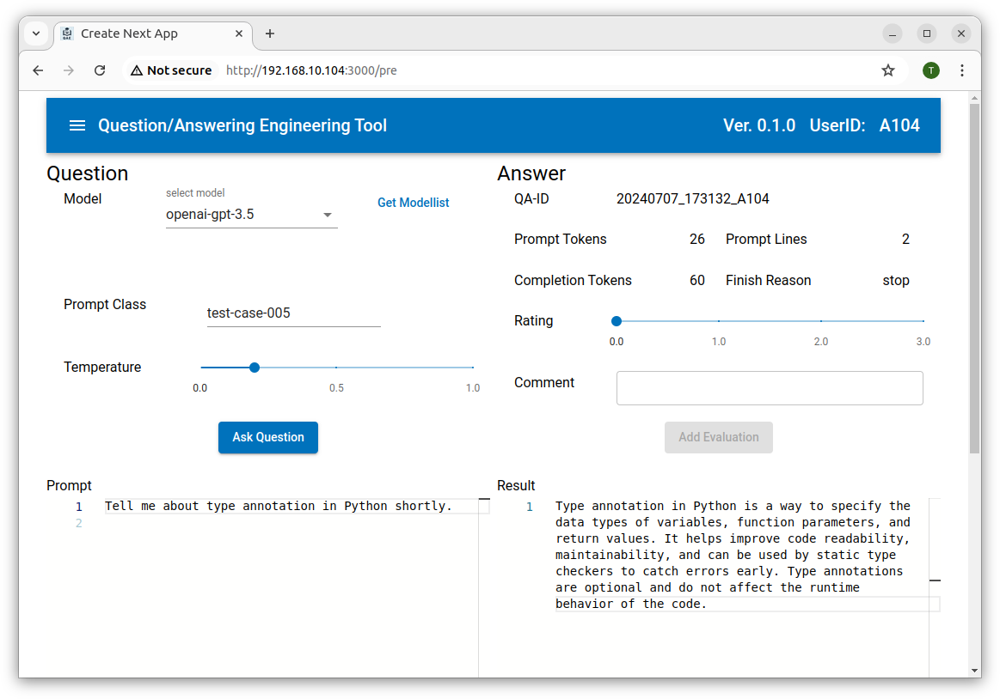

### QA Logs

### Evaluation

## LICENSE

MIT License

Copyright (c) 2024 Takashi-KK

Permission is hereby granted, free of charge, to any person obtaining a copy
of this software and associated documentation files (the "Software"), to deal
in the Software without restriction, including without limitation the rights
to use, copy, modify, merge, publish, distribute, sublicense, and/or sell
copies of the Software, and to permit persons to whom the Software is
furnished to do so, subject to the following conditions:

The above copyright notice and this permission notice shall be included in all
copies or substantial portions of the Software.

THE SOFTWARE IS PROVIDED "AS IS", WITHOUT WARRANTY OF ANY KIND, EXPRESS OR
IMPLIED, INCLUDING BUT NOT LIMITED TO THE WARRANTIES OF MERCHANTABILITY,
FITNESS FOR A PARTICULAR PURPOSE AND NONINFRINGEMENT. IN NO EVENT SHALL THE
AUTHORS OR COPYRIGHT HOLDERS BE LIABLE FOR ANY CLAIM, DAMAGES OR OTHER
LIABILITY, WHETHER IN AN ACTION OF CONTRACT, TORT OR OTHERWISE, ARISING FROM,
OUT OF OR IN CONNECTION WITH THE SOFTWARE OR THE USE OR OTHER DEALINGS IN THE
SOFTWARE.
